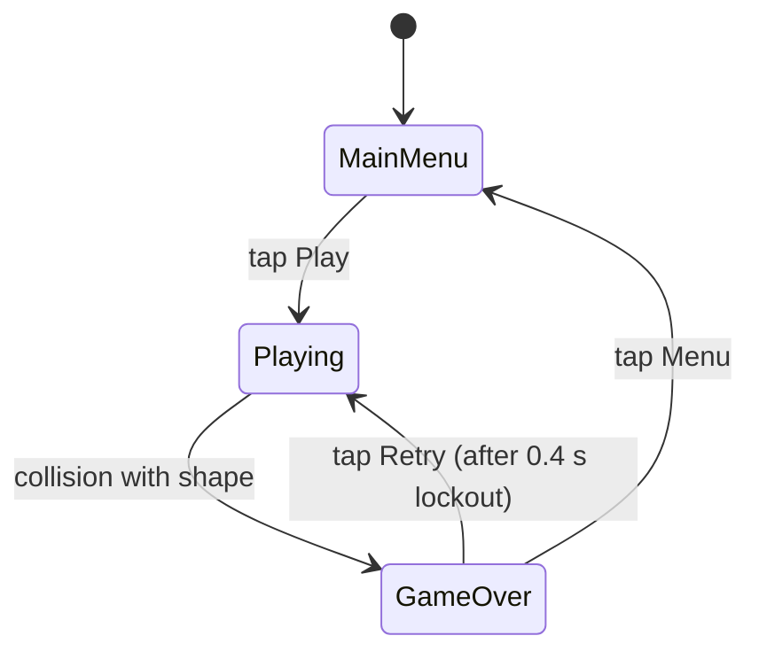
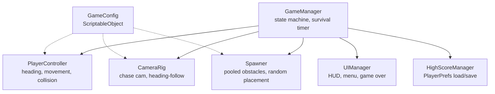

# Game Design Document — *3d arrow*

| | |
|---|---|
| **Working title** | 3d arrow |
| **Team** | Shachar kalderon |
| **Genre** | Arcade / 3D endless obstacle-dodger / survival-timer score-chaser |
| **Target platform** | PC (Windows) , standalone build |
| **Engine / Unity version** | Unity 6 (6000.3.12f1), URP, 3D |
| **Orientation & reference resolution** | Landscape, 1920 × 1080 reference/ 16:9 aspect ratio |
| **Expected session length** | 15 seconds – 4 minutes |
| **Document version** | v0.1 — 2026-09-03 |

---

## 1. High Concept

The player auto-runs forward through open 3D space. Turning left/right steers the player and rotates
a chase camera behind them. Geometric shapes (cubes, spheres, tetrahedra) spawn at random positions in rando sizes(with size limits) ahead. Forward speed climbs every fixed amount of minutes. Touch any shape, you die.
Score is milliseconds survived; best time is saved and shown on death.

### Design pillars

1. **Escalating tension, not escalating control** — speed increases automatically on a fixed timer; the
   player never speeds up or slows down themselves. This rules out a brake/boost input and rules out
   power-ups that pause or reset the ramp.
2. **Read, don't memorize** — every obstacle position is randomized per run, so no run can be solved by
   pattern memory. This rules out hand-authored obstacle sequences or a fixed seed.
3. **One mistake, full stop** — any contact with a shape is instant death, no health bar, no shields, no
   grace frames. This rules out damage buffering, checkpoints, or "hits before death" mechanics.

---

## 2. Reference & Inspiration

- **Primary reference:** *Subway Surfers* — taking: forward auto-run + lateral steering + chase camera
  that turns with the player. Not taking: lane-locked movement, coins/currency, power-ups, or a
  side-scrolling 2.5D camera — Prism Run is free-roam 3D with a fully rotating camera, not fixed lanes.
- **Secondary reference:** *Crossy Road*-style low-poly geometric aesthetic — taking: flat-shaded
  minimal shapes and bright, simple palette. Not taking: grid-based hopping movement.

---

## 3. Core Game Loop

**Moment-to-moment rules** — the things that are true every frame:

- The player moves forward automatically at the current `scrollSpeed`; the player never controls
  forward/backward motion directly, only heading.
- Holding turn-left/turn-right rotates the player's heading at a fixed turnRate  until a fixed `turnAngle`; there
  is no instant snap-turn, so overcorrecting into a shape is always the player's own timing mistake.
- The chase camera sits at a fixed offset behind and above the player and rotates to match the player's
  heading with a short smoothing lag —  the lag is small enough that it never obscures an incoming shape.
- Forward speed ramps every `rampFixedMinutes` in `rampSpeed` jumps from `baseSpeed` to `maxSpeed`, then holds flat at `maxSpeed` for the rest of the run.
- Shapes spawn at randomized positions inside a spawn band ahead of the player at a fixed interval;
  spawn position is randomized on a linier plane between `maxDistanceFoward` and `maxDistanceLeftRight`.
  spawn size between `minScale` and `maxScale`
- **Scoring:** score is exactly the elapsed milliseconds since the run started; it is not derived from
  distance, shapes dodged, or any other proxy — the timer *is* the score.
- **Failure:** any obstacle collider touching the player's collider ends the run immediately. Player
  input is locked, forward motion stops, and after a 0.4 s freeze the Game Over screen appears.

### Parameters you will need to tune

| Parameter | What it controls | First guess |
|---|---|---|
| `baseSpeed` | Forward speed at the start of a run | 4 u/s |
| `maxRamp` | Forward ramp ceiling — once reached, speed holds flat for the rest of the run | 5  |
| `rampFixedMinutes` | How many minutes elapse between each speed jump | 1 min |
| `rampSpeed` | How much forward speed is added at each jump — trades against `rampFixedMinutes`; fewer, bigger jumps feel very different from many small ones | +2 u/s |
| `turnRate` | How fast heading rotates per second while a turn is held | 90 °/s |
| `turnSpeed` | How fast heading moves per second while a turn is held | 0.3 °/s |
| `turnAngle` | The maximum heading offset from forward the player can turn to — caps how sharp a dodge can be, so a shape directly behind a bad turn can become unavoidable on purpose | 60° |
| `spawnInterval` | Time between obstacle spawns — the second difficulty dial alongside speed | 0.6 s |
| `maxDistanceForward` | Far edge of the spawn plane ahead of the player — together with `scrollSpeed` this sets how much warning the player gets | 30 u |
| `maxDistanceLeftRight` | Half-width of the spawn plane — how far left/right a shape can appear from the player's forward line | 8 u |
| `obstaclePoolSize` | How many shape instances exist at once, recycled | 24 |
| `obstaclePoolMinScale` | min scale for obsticales | 24 |
| `obstaclePoolMaxScale` | max scale for obsticales | 24 |

**Where these live:** a `GameConfig` ScriptableObject referenced by `PlayerController`, `GameController` and `Spawner`, so none of the above requires a recompile to change.

**Feel target:** a first-time player survives at least 15 seconds on their first attempt; a player who
has played for five minutes can consistently clear 90+ seconds.

---

## 4. Controls & Input

| Action | Keyboard / Mouse | Gamepad | Touch |
|---|---|---|---|
| Turn left | A / Left Arrow | Left stick / D-pad left | Left half of screen held |
| Turn right | D / Right Arrow | Left stick / D-pad right | Right half of screen held |
| Confirm / Retry | Space / Left Click | South button | Tap anywhere |

- Input is read on **hold** in `Update`, and heading rotation is applied in `FixedUpdate` — so turning
  is frame-rate independent and never skips a physics step.
- While a UI button (Main Menu, Retry) is under the cursor/finger, gameplay turn input is ignored so a
  misclick on a button can't also steer the player into a shape mid-transition.
- On the Game Over screen there is a fixed **0.4 s input lockout** after death, specifically so a death
  caused by holding a turn key doesn't also register as an accidental instant-retry tap.

---

## 5. Screens & UI

1. **Main Menu** — game title, "PLAY" button, "BEST: 00:00.000" readout of the saved high score, no
   settings menu (out of scope for MVP).
2. **Gameplay (in-run)** — no menu chrome at all; HUD only.
3. **Game Over** — "YOU DIED" label, this run's survival time (mm:ss.mmm), "NEW BEST!" label shown only
   if this run beat the saved high score, "RETRY" button, "MENU" button.

- **HUD during play:** current survival time (mm:ss.mmm) top-center, updating every frame. Deliberately
  absent: minimap, health bar, combo counter, or any indicator of upcoming shapes — the player reads the
  environment directly, per pillar 2.
- **Canvas setup:** Screen Space – Camera, CanvasScaler *Scale With Screen Size*, reference 1920 × 1080,
  match = 0.5.

---

## 6. Art & Audio
// will be replaced later
| Asset | Variants / frames | Source & licence | Use |
|---|---|---|---|
| Obstacle shapes | Cube, sphere, tetrahedron, octahedron — 1 flat-shaded material each | Kenney.nl "Prototype Kit", CC0 | In-run obstacles |
| Player capsule | 1 mesh, 2-tone flat material | Built in-engine (primitive + custom material) | Player avatar |
| Ground / skybox | Flat-shaded plane + gradient skybox | Built in-engine | Environment |
| Ambient loop | 1 loop, ~90 s | Kevin MacLeod, "Investigations" — CC BY 3.0 (attribution required) | Menu + gameplay music |
| Death SFX | 1 one-shot | Kenney.nl "Impact Sounds", CC0 | Collision feedback |

**Licence note:** all placeholder and final assets above are either CC0 or CC BY with attribution
included in an in-game credits line; none require a paid licence, so no swap is needed for a public
release beyond keeping the CC BY attribution visible.

**Technical art rules:** Bilinear filtering off for UI text only, all obstacle/player materials
unlit or simple-lit flat shading (no normal maps), single atlas for UI sprites, sorting/rendering
order back→front: skybox → ground → obstacles → player → UI.

---

## 7. Technical Design

//will be fixed later

**Scenes:** one scene, `Game.unity`. Main Menu and Game Over are UI Canvas states within it rather than
separate scenes, since the only thing that resets between runs is game state — restarting a full scene
load would be unnecessary overhead for a game this light.

**Packages / systems used:** Input System, Physics (3D), URP.

**Target device:** <the actual machine you will demo on>

**Architecture:**

| Script | Responsibility |
|---|---|
| `GameManager` | Owns the MainMenu/Playing/GameOver state machine and the survival-time score clock |
| `PlayerController` | Reads turn input, rotates heading, applies forward movement, detects collision |
| `CameraRig` | Follows the player's position and heading with a fixed offset and smoothing lag |
| `Spawner` | Pulls shapes from a pool and places them at randomized positions ahead of the player |
| `ObstacleShape` | Identifies itself as lethal on trigger-enter with the player |
| `UIManager` | Shows/hides the three screens and binds their displayed values |
| `HighScoreManager` | Loads the saved best time on boot, writes a new one on a beaten record |

### The course features you are implementing

1. **Object pooling** — the obstacle shapes are pooled (24 live instances, recycled by `Spawner`)
   because instantiating/destroying shapes continuously during play causes GC spikes, and a dropped
   frame in a game where death is one touch away is an unfair death.
2. **ScriptableObject-driven configuration** — every tunable in the Parameters table lives on a single
   `GameConfig` asset so the ramp curve and spawn density can be retuned by a designer without touching
   PlayerController or Spawner code.
3. **Finite state machine** — `GameManager` enforces MainMenu → Playing → GameOver as the only legal
   transitions, so input can never be read for gameplay while the Game Over screen is showing.
4. **Persistent data (PlayerPrefs)** — the single high-score float is the only thing that survives
   between runs, loaded on boot and only overwritten when a run's survival time exceeds it.

---

## 8. Scope

### 8.1 MVP — the game is not a game without these

- [ ] Forward auto-run at `scrollSpeed`, with left/right heading control
- [ ] Chase camera that rotates with the player's heading
- [ ] Speed ramp from `baseSpeed` to `maxSpeed`every fixed amounbts of minutes
- [ ] Randomized obstacle spawning ahead of the player, pooled
- [ ] Instant death on collision with any obstacle
- [ ] Survival-time score display during play, in milliseconds precision
- [ ] Game Over screen showing this run's time, with Retry
- [ ] High score saved via PlayerPrefs and shown on the Main Menu and Game Over screen
- [ ] having a main menu
- [ ] having game over screen(wiht retry/main menu options)

### 8.2 Polish — if the MVP is done and playable

- [ ] Multiple obstacle shape types with different silhouettes for visual variety
- [ ] Death VFX (shatter/particle burst) and a screen-shake on collision
- [ ] Subtle audio pitch-ramp tied to current speed, so the player *hears* the difficulty rising
- [ ] "New Best!" animated callout on the Game Over screen
- [ ] Menu music + ambient in-run loop with a smooth crossfade between states

### 8.3 Explicitly out of scope — we are **not** building these

- Multiplayer, online leaderboards, or any networked service of any kind
- Power-ups, shields, extra lives, or any mechanic that interrupts an instant death
- Multiple game modes (time attack, seeded runs, etc.) — there is exactly one mode
- A save system beyond the single `PlayerPrefs` high-score float — no run history, no replays
- Mobile builds — target is PC/macOS standalone only
- A level editor or hand-authored obstacle layouts of any kind

---

## Changelog

| Version | Date | Change |
|---|---|---|

